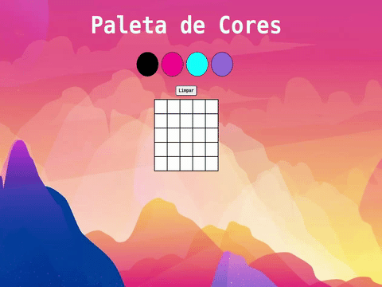

#  Projeto Pixel Art   🖌️ 🎨

  

  

 

## :memo: Descrição

Projeto Pixel Art - Paleta de cores

 
## :books: Funcionalidades
* <b>Funcionalidade </b>: A aplicação é um editor de arte com pixels em que a pessoa usuária poderá escolher uma cor em uma paleta de cores e poderá pintar o que quiser usando sua criatividade.

## :wrench: Tecnologias utilizadas
* JavaScript;
* HTML;
* CSS;

## :soon: Implementação futura
* tornar a aplicação responsiva

